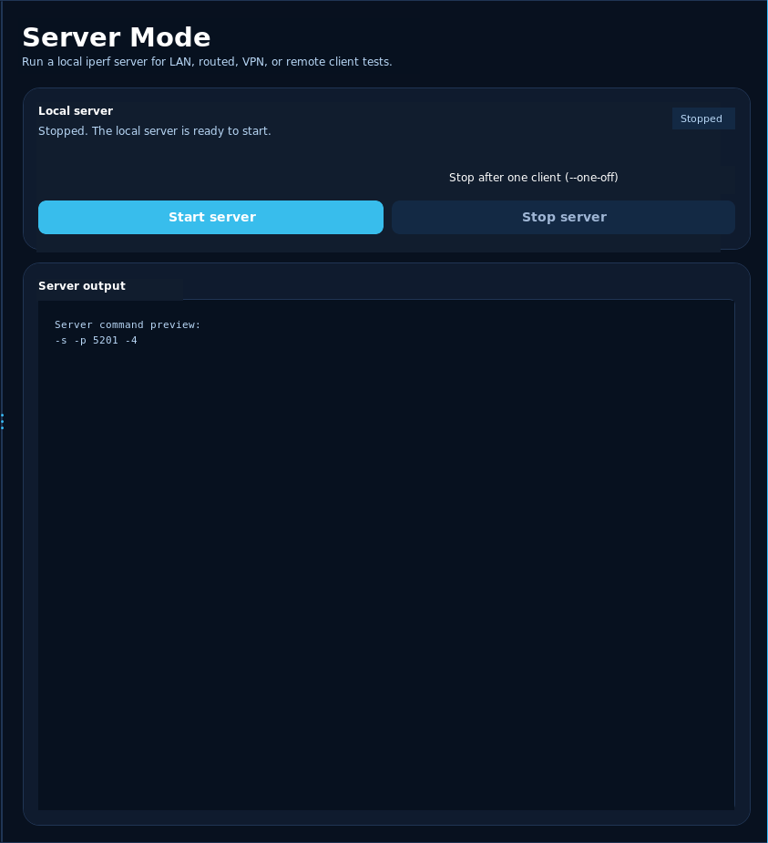
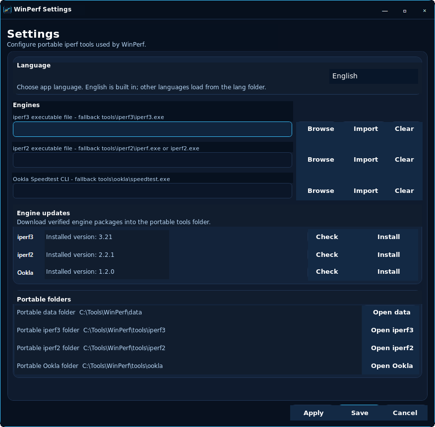

# WinPerf

**Portable Windows GUI for iperf, Ookla Speedtest, and repeatable network
throughput checks.**

WinPerf turns common Windows network performance tests into a compact desktop
workflow: choose the engine, target, protocol, duration, streams, and mode, then
watch live results without rebuilding command-line flags by hand.

It is built for admins, homelab users, consultants, and troubleshooting sessions
where repeatable checks, readable charts, portable runtime data, and a clear
command preview matter.

## Screenshots

## Highlights

- Guided iperf dashboard for TCP upload, TCP download, bidirectional tests, UDP
  upload/download, streams, warm-up/omit time, and command preview.
- iperf3 and iperf2 support, including portable executable discovery/import and
  engine status checks.
- Ookla Speedtest CLI integration for internet speed tests alongside technical
  iperf LAN/WAN tests.
- Server mode for turning the current Windows machine into an iperf receiver.
- Live gauges, throughput charting, total/per-stream samples, jitter/loss, and
  raw engine output.
- Saved profiles, friendly server names, and recent targets for repeatable
  before/after testing.
- Portable history, settings, language packs, and engine folders kept beside the
  app instead of scattered through the system.
- Guarded package/update handling for full builds, designed to replace only
  `WinPerf.exe` and preserve runtime data.

## Good For

| Scenario | Why it helps |
|---|---|
| Home lab checks | Compare VM, NAS, switch, Wi-Fi, router, and firewall paths quickly |
| Admin troubleshooting | Repeat the same test while changing cables, VLANs, VPNs, or routes |
| Wi-Fi and LAN validation | Spot real throughput changes with consistent stream and duration settings |
| VPN testing | Compare tunnel performance with the same command profile every time |
| Internet speed checks | Run Ookla CLI tests from the same portable tool surface |
| Portable toolkits | Carry one self-contained Windows executable plus portable data folders |

## Typical Workflow

1. Import or select an `iperf3.exe`, `iperf.exe` / `iperf2.exe`, or Ookla
   `speedtest.exe`.
2. Choose a saved profile, friendly server name, recent target, or direct
   server address.
3. Pick the engine, protocol, mode, port, duration, stream count, and optional
   UDP bandwidth.
4. Run the test and watch the live chart, latest values, result summary, and raw
   engine output.
5. Save the profile or review the portable history when the result needs to be
   repeated or compared later.

## Main Workflows

| Area | What it does |
|---|---|
| Dashboard | Fast iperf client tests with live visualization and command preview |
| Speed Test | Ookla CLI and quick iperf presets for internet/client speed checks |
| Server Mode | Runs this Windows machine as an iperf receiver |
| History | Saves recent results with command details for later review |
| Profiles | Stores reusable iperf configurations and named targets |
| Settings | Manages engines, portable paths, language selection, and update checks |

## Test Types

| Mode | Notes |
|---|---|
| TCP upload | Standard client-to-server throughput test |
| TCP download / reverse | Server sends traffic back to the client |
| TCP bidirectional | Client and server transmit at the same time when supported |
| UDP upload/download | Useful for jitter, packet-loss, and bandwidth-limit checks |
| UDP bidirectional | Bidirectional UDP workflow where the selected engine supports it |
| Server mode | Run this Windows machine as the iperf receiver |
| Custom command | Use advanced flags directly when the dashboard is not enough |

## Portable Runtime

WinPerf is designed around a portable runtime folder. The executable can live
beside user data and tools, while updates and smoke builds must preserve those
runtime folders.

| Folder | Purpose |
|---|---|
| `data/` | Saved settings, profiles, named servers, and result history |
| `tools/` | Imported iperf and Ookla CLI executables |
| `lang/` | Editable external language packs, including Slovak |

Packaged builds are intended as a single self-contained `WinPerf.exe`. Source
development uses .NET 9.

## Profiles And History

Profiles keep common test settings together. Friendly server names make direct
targets easier to recognize while commands still use the raw address. History
keeps recent results and command details so before/after testing does not depend
on screenshots alone.

## Releases

Public/source repository releases are manual-only and may lag private
distribution builds. Release ZIPs must contain exactly one file:

- `WinPerf.exe`

[View public source releases](https://github.com/Vaso73/WinPerf/releases)

## Goal

WinPerf is meant to be a calm, practical companion for network testing: quick
enough for daily troubleshooting, clear enough for repeatable checks, and still
close enough to iperf for advanced users to know what is happening.
