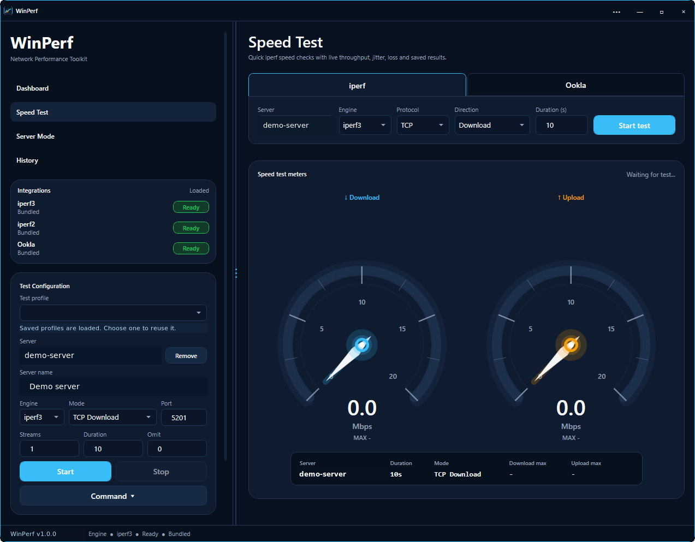
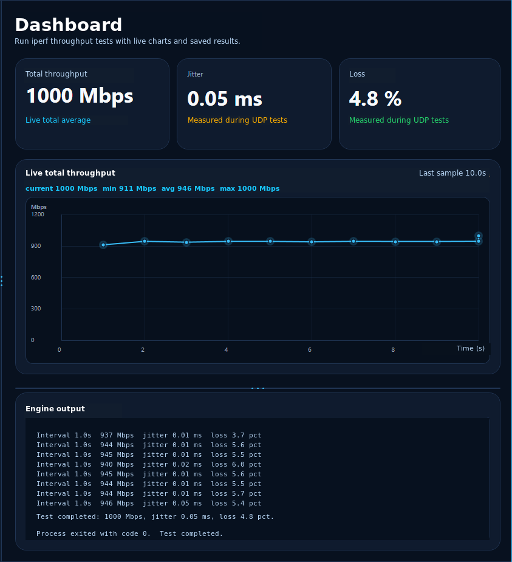
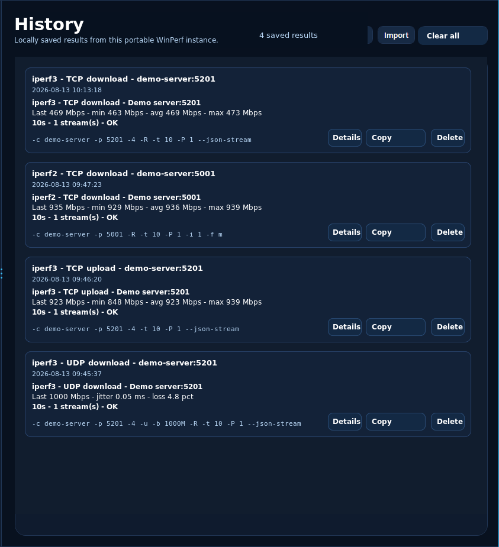

# WinPerf

Portable Windows network performance toolkit for quick iperf and Ookla
Speedtest checks.

WinPerf is a compact desktop workflow for repeatable throughput testing. It is
made for admins, homelab users, consultants, and troubleshooting sessions where
clear results, portable data, and a readable command preview matter.

  <picture>
    <source srcset="docs/images/winperf-hero.webp" type="image/webp">
    
  </picture>

## 🚀 Download

Public GitHub releases provide **WinPerf Free** builds.

- Download the latest public release from
  [GitHub Releases](https://github.com/Vaso73/WinPerf/releases/latest).
- The release ZIP contains exactly one file: `WinPerf.exe`.
- No installer is required. Keep the executable in a portable folder with your
  runtime data.

## ✨ Included In WinPerf Free

WinPerf Free is meant for quick, safe public network checks:

- iperf3 TCP upload and TCP download tests
- fixed 1 stream and 10 second test duration
- Ookla Speedtest with automatic server selection only
- local history capped to 5 results
- separate portable data folder: `free-data/`
- GitHub-based path to Sponsor Pro

## 🔒 Sponsor Pro

Sponsor Pro keeps the full toolkit for active GitHub Sponsors:

- iperf2, UDP, and bidirectional tests
- server mode
- advanced/custom commands
- manual Ookla server selection and favorites
- history import/export
- engine package updates
- private automatic updates

[Support the project through GitHub Sponsors](https://github.com/sponsors/Vaso73)
to unlock the Sponsor Pro channel.

## 🖼️ Screenshots

  

<strong>More screenshots</strong>

  
  

## 🧩 Good For

| Scenario | Why it helps |
|---|---|
| Home lab checks | Compare VM, NAS, switch, Wi-Fi, router, and firewall paths quickly |
| Admin troubleshooting | Repeat the same test while changing cables, VLANs, VPNs, or routes |
| Wi-Fi and LAN validation | Spot real throughput changes with consistent settings |
| Internet speed checks | Run Ookla CLI tests from the same portable tool surface |
| Portable toolkits | Carry one self-contained Windows executable plus portable data folders |

## 📦 Public Repository Scope

This public repository is used for WinPerf Free presentation and distribution.
The full development source and Sponsor Pro release channel are maintained
privately.

Public release packages must not contain source code, runtime data, tools,
language packs, debug symbols, or configuration files.

## 📜 License

WinPerf Free is distributed as a binary public freeware build under the terms in
[`LICENSE`](LICENSE). The public repository does not grant an open-source
license to the private WinPerf source code or Sponsor Pro-only features.

## ❤️ Support

[Compare editions](#-included-in-winperf-free) ·
[Get Sponsor Pro](https://github.com/sponsors/Vaso73)
